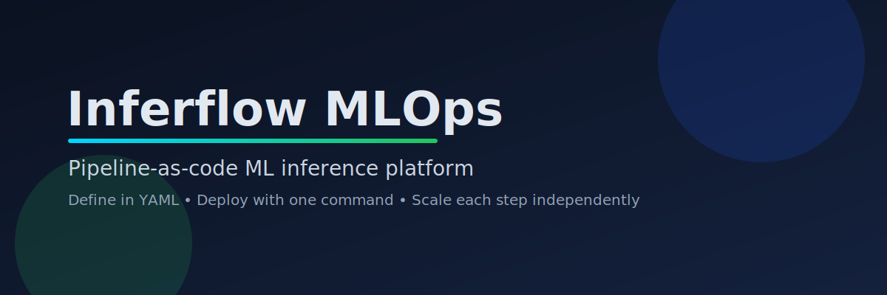
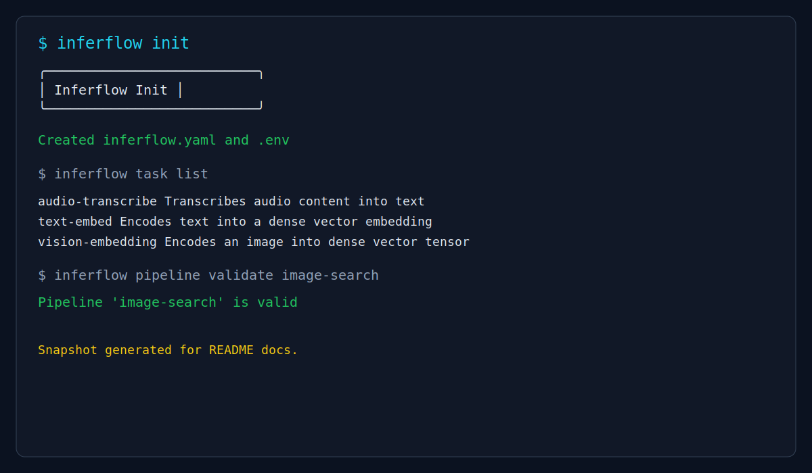
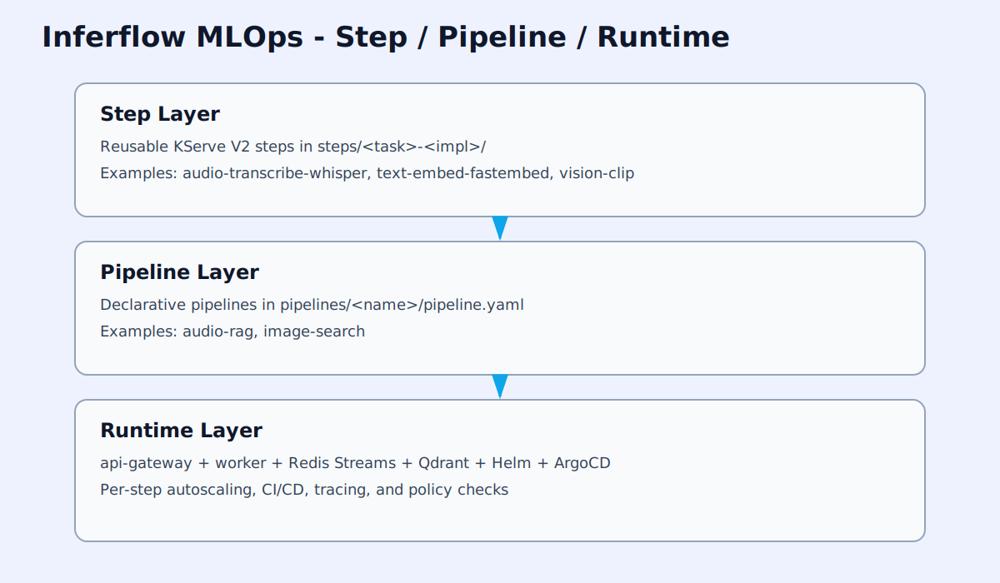
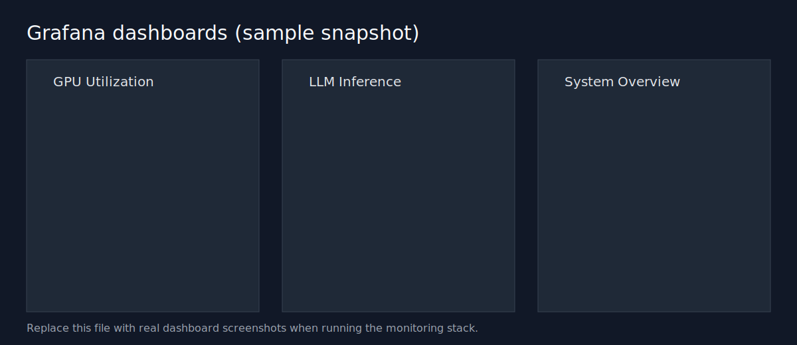
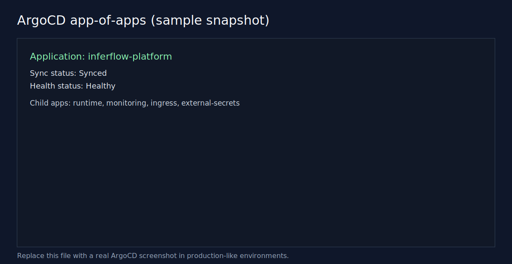
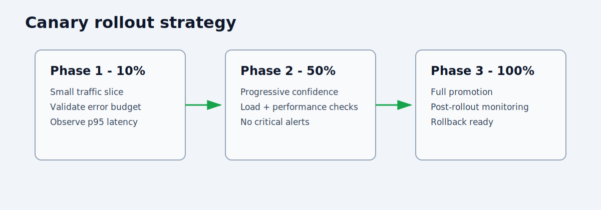

# Inferflow MLOps



[](https://www.python.org/downloads/)
[](LICENSE)
[](https://github.com/jgallego9/inferflow-mlops/actions/workflows/ci.yml)
[](https://github.com/jgallego9/inferflow-mlops/actions/workflows/step-ci.yml)

A production-ready, pipeline-as-code ML inference platform.
Define your AI pipeline in YAML, deploy with one command, and scale each step independently.

## Why this project

- Problem: most ML demos are tightly coupled and hard to evolve from one use case.
- Solution: split inference into reusable KServe V2 steps and compose pipelines declaratively.
- Differentiator: the same runtime supports multiple pipelines and independent step scaling without template rewrites.

## 2-Minute Setup

```bash
git clone <repo-url>
cd inferflow-mlops
uv tool install ./tools/inferflow-cli
inferflow init
```

If you want full local validation:

```bash
uv sync --all-packages --dev
make ci
```

## Demo Snapshot



## Architecture



Project layers:

1. Step layer: reusable units in `steps/<task>-<impl>/`.
2. Pipeline layer: contracts in `pipelines/<name>/pipeline.yaml`.
3. Runtime layer: api-gateway + worker + Redis + Qdrant + Helm/ArgoCD.

Detailed docs are in [docs/architecture.md](docs/architecture.md).

## Add a Pipeline in 3 Steps

1. Define `pipelines/<name>/pipeline.yaml`.
2. Validate compatibility:

```bash
inferflow pipeline validate <name>
```

3. Enable it in Helm values under `.Values.pipelines.<name>`.

Generic templates in `infra/helm/inferflow/templates/steps/` already create Deployments, Services, optional HPA, PDB, and model cache PVC mounts.

## Available Steps

| Step | Description | Schema (input -> output) | Version | CI |
|---|---|---|---|---|
| `audio-transcribe-whisper` | Audio transcription | `audio_url` -> `text` | `1` |  |
| `text-embed-fastembed` | Text embedding | `text` -> `embedding` | `1` |  |
| `vector-index-qdrant` | Vector indexing | `vector,metadata` -> `status` | `1` |  |
| `vector-search-qdrant` | Vector search | `vector` -> `results` | `1` |  |
| `vision-clip` | Image embedding for retrieval | `image_url` -> `vector` | `1` |  |

## Built-in Tasks

Task schemas live in `tasks/<task>/schema.json`.

| Task | Purpose |
|---|---|
| `audio-transcribe` | Speech-to-text conversion |
| `text-embed` | Dense text embeddings |
| `vector-index` | Vector upsert into store |
| `vector-search` | Nearest-neighbor retrieval |
| `vision-embedding` | Dense image vectors |

## Inferflow CLI

Current command groups:

```text
inferflow init [--non-interactive]

inferflow task list|show|new
inferflow step list|new|test|build|push|show

inferflow pipeline list|new|validate|dev|run|deploy|status|logs|scale|rollback|metrics
inferflow models prefetch|status|clear
inferflow job status|result
```

Tip: run `inferflow <group> --help` for command-specific flags and examples.

Install globally:

```bash
uv tool install ./tools/inferflow-cli
```

## Tech Stack

### Runtime


### Infra


### Observability


### Developer Experience


## Performance Benchmarks

| Metric | Value | Notes |
|---|---|---|
| Test suite | `120/120` passing | `make ci` baseline |
| Coverage | `>=80%` gate | enforced by pytest config |
| Lint/typecheck | strict | ruff + mypy in CI |
| Image security | Trivy `HIGH/CRITICAL` gate | runtime and step workflows |

## Observability and GitOps Snapshots





## Canary Deployment Model



## Roadmap

Backlog source of truth: [BACKLOG.md](BACKLOG.md)

Project board (kanban): https://github.com/users/jgallego9/projects

## Contributing

Please read [CONTRIBUTING.md](CONTRIBUTING.md).

Good first issues: https://github.com/jgallego9/inferflow-mlops/labels/good%20first%20issue

## Security

See [SECURITY.md](.github/SECURITY.md).

## Changelog

See [CHANGELOG.md](CHANGELOG.md).

## Extended Docs

- [docs/architecture.md](docs/architecture.md)
- [docs/adding-a-pipeline.md](docs/adding-a-pipeline.md)
- [docs/adding-a-step.md](docs/adding-a-step.md)
- [docs/local-setup.md](docs/local-setup.md)
- [docs/quickstart.md](docs/quickstart.md)
- [docs/engineering-audit.md](docs/engineering-audit.md)
- [docs/architecture-benchmark.md](docs/architecture-benchmark.md)
- [docs/repo-structure.md](docs/repo-structure.md)
- [docs/final-quality-gate.md](docs/final-quality-gate.md)
- [docs/github-manual-operations.md](docs/github-manual-operations.md)
